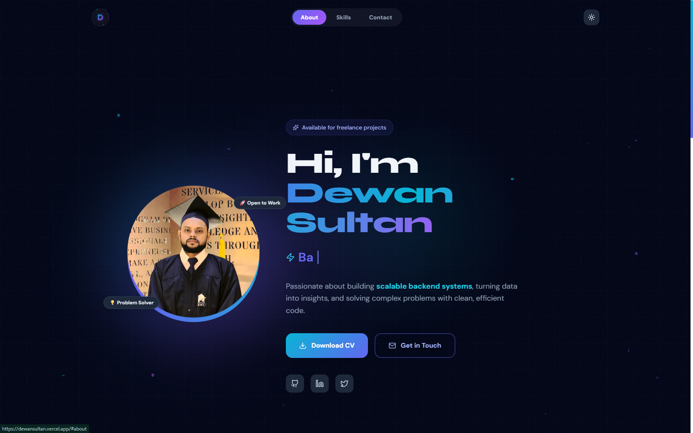

# 🌐 Dewan Sultan — Personal Portfolio

<div align="center">



[](https://dewansultan.vercel.app)
[](https://react.dev)
[](https://vitejs.dev)
[](https://tailwindcss.com)

A modern, animated personal portfolio built with React, Framer Motion, and Tailwind CSS. Features dark/light mode, animated skill cards, a working contact form, and a custom SVG logo.

</div>

---

## ✨ Features

- 🎨 **Animated UI** — Framer Motion parallax, floating particles, shimmer text, and scroll-triggered animations
- 🌙 **Dark / Light Mode** — Persisted via `localStorage`
- ⌨️ **Typing Effect** — Auto-cycling role titles with blinking cursor
- 📊 **Animated Skill Bars** — Per-technology progress bars with scroll reveal
- 📬 **Working Contact Form** — Powered by EmailJS, no backend needed
- 🖼️ **Custom Animated Logo** — SVG with spinning conic gradient ring
- 📱 **Fully Responsive** — Mobile-first layout
- 🚀 **Deployed on Vercel** — CI/CD via GitHub integration

---

## 🛠️ Tech Stack

| Technology                                      | Purpose                   |
| ----------------------------------------------- | ------------------------- |
| [React 18](https://react.dev)                   | UI framework              |
| [Vite](https://vitejs.dev)                      | Build tool & dev server   |
| [Tailwind CSS](https://tailwindcss.com)         | Utility-first styling     |
| [Framer Motion](https://www.framer.com/motion/) | Animations & transitions  |
| [EmailJS](https://emailjs.com)                  | Contact form (no backend) |
| [Lucide React](https://lucide.dev)              | Icons                     |

---

## 📁 Project Structure

```
portfolio/
├── public/
│   ├── logo.svg          # Animated SVG logo
│   ├── profile.jpg       # Profile photo
│   └── cv.pdf            # Downloadable CV
├── src/
│   ├── Portfolio.jsx     # Main component
│   ├── index.css         # Global styles + animations
│   ├── app.css           # Root reset styles
│   └── main.jsx          # React entry point
├── .env                  # EmailJS keys (not committed)
├── .gitignore
├── index.html
├── tailwind.config.js
├── vite.config.js
└── README.md
```

---

## 🚀 Getting Started

### Prerequisites

- Node.js `18+`
- npm or yarn

### Installation

```bash
# 1. Clone the repository
git clone https://github.com/Rbn-Rmn/portfolio.git
cd portfolio

# 2. Install dependencies
npm install

# 3. Set up environment variables
cp .env.example .env
# Then fill in your EmailJS keys (see below)

# 4. Start the dev server
npm run dev
```

Open [http://localhost:5173](http://localhost:5173) in your browser.

---

## 📧 EmailJS Setup

This portfolio uses [EmailJS](https://emailjs.com) to send emails from the contact form without a backend.

1. Create a free account at [emailjs.com](https://emailjs.com)
2. Add an **Email Service** (Gmail recommended)
3. Create an **Email Template** with variables `{{name}}`, `{{email}}`, `{{message}}`
4. Copy your credentials into `.env`:

```env
VITE_EMAILJS_SERVICE_ID=your_service_id
VITE_EMAILJS_TEMPLATE_ID=your_template_id
VITE_EMAILJS_PUBLIC_KEY=your_public_key
```

> ⚠️ Never commit your `.env` file. It's already included in `.gitignore`.

---

## 🔧 Environment Variables

Create a `.env` file in the root directory:

```env
VITE_EMAILJS_SERVICE_ID=your_service_id
VITE_EMAILJS_TEMPLATE_ID=your_template_id
VITE_EMAILJS_PUBLIC_KEY=your_public_key
```

For **Vercel deployment**, add these same variables in:
`Vercel Dashboard → Project → Settings → Environment Variables`

---

## 📦 Build & Deploy

```bash
# Build for production
npm run build

# Preview production build locally
npm run preview
```

### Deploy to Vercel

1. Push your code to GitHub
2. Go to [vercel.com](https://vercel.com) → **New Project** → Import your repo
3. Add environment variables in Vercel dashboard
4. Click **Deploy** — done! ✅

Vercel auto-deploys on every push to `main`.

---

## 🎨 Customization

To make this portfolio your own, update these in `Portfolio.jsx`:

| Item           | Location                                   |
| -------------- | ------------------------------------------ |
| Your name      | `<h1>` in hero section & loading screen    |
| Roles / titles | `roles` array                              |
| Bio text       | `<motion.p>` in hero section               |
| Skill levels   | `skills` array in each card                |
| Stats          | `stats` array below skill cards            |
| Social links   | `SOCIALS` constant                         |
| Email address  | `href="mailto:..."` in Get in Touch button |
| CV file        | Replace `public/cv.pdf`                    |
| Profile photo  | Replace `public/profile.jpg`               |
| Logo           | Replace `public/logo.svg`                  |

---

## 📄 License

This project is open source and available under the [MIT License](LICENSE).

---

<div align="center">

Made with ❤️ by **Dewan Sultan**

[](https://github.com/Rbn-Rmn)
[](https://www.linkedin.com/in/dewansultan/)

</div>
